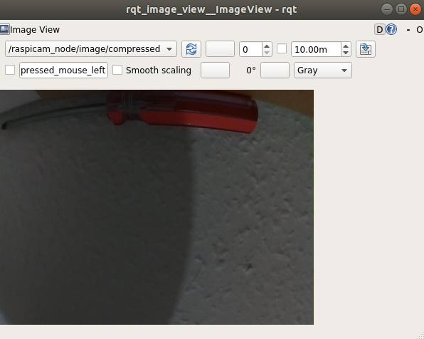
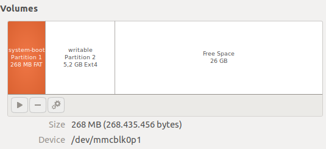

Title: ROS experience
Author: SergeM
Date: 2019-08-24 20:32:00
Slug: ros-experience
Tags: ros, linux, robotics, raspberry, pi, ubuntu, melodic, kinetic, camera, tensorflow


## ROS on raspberry pi
There is a compiled image for RPi by ubiquity that has ROS kinetic: 
[https://downloads.ubiquityrobotics.com/pi.html](https://downloads.ubiquityrobotics.com/pi.html).


It seems for me too old. It's 2020, there are ubuntu 18, ros melodic and ros2, next year the support of python2.7 will be discontinued. Meh... 

It is possible to have **ROS melodic on Raspberry Pi 3 B+**. See in the next sections.

## Installing tensorflow for ROS on raspberry pi

Alternatively one can try to install it from wheels:
https://www.tensorflow.org/install/pip?lang=python3#package-location

The dependencies are better to install using pip and piwheels.org:
```
sudo pip3 install --extra-index-url=https://www.piwheels.org/simple -U tensorflow keras
```

### Issues
#### h5py
I encountered an error about h5py: 
```
ImportError: libhdf5_serial.so.100: cannot open shared object file: No such file or directory
```
installing 
```
sudo apt-get install libhdf5-dev
sudo apt-get install libhdf5-serial-dev
```
didnt help.

Some version mismatch

I could resolve it by compiling h5py with my version:
```
HDF5_VERSION=1.8.16 sudo pip3 install --no-binary=h5py h5py
```

#### load_img

`keras_preprocessing.image.utils.load_img` results in the error:
```
  File "/home/ubuntu/sergem_robocar/py3/lib/python3.5/site-packages/keras_preprocessing/image/utils.py", line 108, in load_img
    raise ImportError('Could not import PIL.Image. '
ImportError: Could not import PIL.Image. The use of `load_img` requires PIL.
```

pillow is installed. 

The error may be caused by missing jpeg libraries. Try to load PIL in a separate python and check if it works.
I got the following error.
```python
>>> from PIL import Image as pil_image
Traceback (most recent call last):
  File "<stdin>", line 1, in <module>
  File "/home/ubuntu/sergem_robocar/py3/lib/python3.5/site-packages/PIL/Image.py", line 95, in <module>
    from . import _imaging as core
ImportError: libjpeg.so.62: cannot open shared object file: No such file or directory
```

Easily solvable by 
```
sudo apt install libjpeg62
```


## Name clash in dynamic_reconfigure
Probably it is written somewhere but I haven't read the docs...

I am developign a node for robot steering translation. I got an error:
```
$ rosrun steering_translator steering_translator.py 
Traceback (most recent call last):
  File "/home/user/omicron_robocar/catkin_ws/src/steering_translator/src/steering_translator.py", line 5, in <module>
    import steering_translator.cfg
  File "/home/user/omicron_robocar/catkin_ws/src/steering_translator/src/steering_translator.py", line 5, in <module>
    import steering_translator.cfg
ImportError: No module named cfg
```

I did everything according to the tutorials [How to Write Your First .cfg File](http://wiki.ros.org/dynamic_reconfigure/Tutorials/HowToWriteYourFirstCfgFile)
and [Setting up Dynamic Reconfigure for a Node (python)](http://wiki.ros.org/dynamic_reconfigure/Tutorials/SettingUpDynamicReconfigureForANode%28python%29), just changed couple of names.
The problem was in the naming of the package (steering_translator) and the executable file (steering_translator.py). They are getting mixed up on the execution. The solution was to rename python file to steering_translator_node.py.


## ROS melodic on Raspberry Pi 3 B+

Although there is a pre-built ros-kinetic image from Ubuquity, 
I would like to run ROS melodic on my Raspberry Pi 3 b+ with Raspberry Camera support.

You can find the image I built [here](https://yadi.sk/d/A76jFgiVx_vycA).
 
md5 checksum:

    a65a6968eb7cdf39655eaee9ee82b38c  20200207_ubuntu_armhf_ros_melodic.img.gz

To use it you need to download it and write on SD card as with any other image for RPi.

Credentials:

* User: ubuntu

* password: robotrobot

* wifi hotspot SSID: ub_rpi_net

* wifi password: robotwifi

Change the passwords as soon as you logged in. 

If you want to build the image yourself, you can follow the instructions bellow.

### Prepare ubuntu 18 LTS for Raspberry Pi

* go to [Ubuntu PaspberryPi](https://wiki.ubuntu.com/ARM/RaspberryPi),
  download 18.04 LTS for armhf architecture: 
  [ubuntu-18.04.3-preinstalled-server-armhf+raspi3.img.xz](http://cdimage.ubuntu.com/releases/bionic/release/ubuntu-18.04.3-preinstalled-server-armhf+raspi3.img.xz) 
  
  I tried to run arm64 version but encountered issues with building ROS node for raspberry pi. With armhf it works.  

* write the image to SD card

* to enable camera open `/boot/config.txt` on SD card and make sure the following lines are there:
      
      start_x=1             
      gpu_mem=128    # at least, or more if you wish
    
    
* insert the flash card into the Raspberry


### Connecting Raspberry

* Switch on the Raspberry

* It turned out that Raspberry pi cannot connect to my laptop directly 
  with the default ethernet settings
  (something is wrong with my DHCP settings). 

  * One option is to use router:

      * Connect RPi to a router with a cable 
      * connect your laptop to the same router
      
  * Another option is to change the settings of the connection on the laptop so that the connection in shared.
   This way IP gets automatically assigned to both laptop and Raspberry.
    


  * find the ip address of the connected Raspberry with one of the commands:
     * `nmap -sn YOUR_ROUTER_IP/24` or `nmap -sn YOUR_LAPTOP_IP/24`. the command may differ depending on the DHCP settings of your network. 
       In my case it is `nmap -sn 192.168.125.1/24`
     * For direct connection: `arp -a`
  * `ssh -X ubuntu@RASPBERRY_IP`, use password `ubuntu`. 
    * `-X` option allows to run gui apps via ssh.
  
  
### Update the system

    sudo add-apt-repository ppa:ubuntu-raspi2/ppa  # for standard RPi tools 
    sudo apt update && sudo apt upgrade  # this will take some time


If the update doesn't work the reason could be time synchronization between ubuntu servers and raspberry py. 
Try to install ntp: `sudo apt install ntp`

### Remove unnecessary tools

Removing cloud-init:

    sudo apt-get purge cloud-init
    # archive file for a backup
    sudo tar --remove-files -cvzf ~/backup-cloud-init.tar.gz /etc/cloud/ /var/lib/cloud/
    sudo reboot  # restart
    

### Install ROS Melodic

Follow the standard instructions from [Ubuntu install of ROS Melodic](http://wiki.ros.org/melodic/Installation/Ubuntu).
I was installing `sudo apt install -y ros-melodic-ros-base` to save some time and disk space.


### Setting up a node for Raspberry Camera

I would like to use the standard RPi camera with ROS. 
There is a node [raspicam_node](https://github.com/UbiquityRobotics/raspicam_node) by Ubiquity, but there is no compiled version 
for ROS melodic that I could install using `apt`. Let's compile it. I have checked out `kinetic` branch, revision `3209cd801b1006c8959540f4efc3774ee19aaa78`.  

    mkdir -p ~/catkin_ws/src
    cd ~/catkin_ws/src
    git clone https://github.com/UbiquityRobotics/raspicam_node
    cd ~/catkin_ws/
    source /opt/ros/melodic/setup.bash
    
 
Open file `/etc/ros/rosdep/sources.list.d/30-ubiquity.list` and add there the line:
    
    yaml https://raw.githubusercontent.com/UbiquityRobotics/rosdep/master/raspberry-pi.yaml

Now update dependencies:

    rosdep update
    cd ~/catkin_ws
    rosdep install --from-paths src --ignore-src --rosdistro=melodic -y
    
Build:

    catkin_make install
 
Install rqt_image_view to see the results:
       
    sudo apt install -y ros-melodic-rqt-image-view
    
Install tools to work with raspberry camera:

    sudo apt install -y libraspberrypi-bin libraspberrypi-bin-nonfree
    
For example, now you can make a photo using raspi camera:

    raspistill -o img.jpg

Test run of the raspicam_node:

    source ~/catkin_ws/devel/setup.bash
    roslaunch raspicam_node camerav2_1280x960.launch

    
You have to see the following line in the end:
    
    [ INFO] [1581100897.421303654]: Video capture started
    
Press Ctrl+C to stop the node.
    
If you get an error like this:

    setting /run_id to fb66ef3e-49d5-11ea-9db0-b827eb318c11
    process[rosout-1]: started with pid [23520]
    started core service [/rosout]
    process[raspicam_node-2]: started with pid [23523]
    mmal: mmal_vc_component_create: failed to create component 'vc.ril.camera' (1:ENOMEM)
    mmal: mmal_component_create_core: could not create component 'vc.ril.camera' (1)
    mmal: Failed to create camera component
    [ERROR] [1581099401.593581701]: Failed to create camera component
    [ERROR] [1581099401.596934388]: init_cam: Failed to create camera component

that mean you haven't enable camera. Look at the instructions above 
about config.txt file.


Now you can try to run camera node in the background and run rqt_image_view to check if the camera works:

    roslaunch raspicam_node camerav2_1280x960.launch &
    rosrun rqt_image_view rqt_image_view
    
Result should look like this:




### Enabling wifi connection

Let's say you want Raspberry pi to automatically connect to your home wifi network.

Install NetworkManager: 

    sudo apt install -y network-manager

enable network manager

    sudo systemctl enable NetworkManager
    sudo systemctl start NetworkManager


add a connection to your Wifi router 

    nmcli device wifi rescan
    nmcli device wifi list
    nmcli device wifi connect SSID-Name password PASSWORD

#### Enable hot spot Wifi on RaspberryPi (ubuntu 18.04)

Enabling hotspot on raspberry allows connection via Wifi without having a router or ethernet cable.

install and enable network manager as described above

Create hotspot connection:

    sudo nmcli dev wifi hotspot ifname wlan0 ssid ub_rpi_net password "robotwifi"
    
Enable autoconnection and enable the connection:
    
    sudo nmcli connection modify Hotspot connection.autoconnect True
    nmcli con up Hotspot
    
You can change the default IP addresses for the Hotspot (optional):
    
    sudo nmcli connection modify Hotspot ipv4.addresses 192.168.111.1/24
    sudo nmcli connection modify Hotspot ipv4.gateway 192.168.111.1
    
    
restart network manager to enable the changes:
    
    sudo systemctl restart NetworkManager


Your `/etc/NetworkManager/system-connections/Hotspot` file will look like this:

    ubuntu@ubuntu:~/catkin_ws$ sudo cat /etc/NetworkManager/system-connections/Hotspot 
    [connection]
    id=Hotspot
    uuid=a1103c90-07ab-4a2b-ba54-e267a716df2d
    type=wifi
    permissions=
    timestamp=1581101574
    
    [wifi]
    mac-address=B8:27:EB:64:D9:44
    mac-address-blacklist=
    mode=ap
    seen-bssids=B8:27:EB:64:D9:44;
    ssid=ub_rpi_net
    
    [wifi-security]
    group=ccmp;
    key-mgmt=wpa-psk
    pairwise=ccmp;
    proto=rsn;
    psk=robotwifi
    
    [ipv4]
    address1=192.168.111.1/24,192.168.111.1
    dns-search=
    method=shared
    
    [ipv6]
    addr-gen-mode=stable-privacy
    dns-search=
    method=ignore


After that you should be able to connect your laptop to the hotspot and ssh to another address: `ssh -X ubuntu@192.168.111.1` 
    
### Creating an image of the SD card for recovery

One can create the image using the standard Ubuntu Disks app on your laptop.
Alternatively we can use `dd` with saves some clicks, but more dangerous is a way.

Assuming `/dev/mmcblk0` is your SD card. Creating an image for the whole SD card:

    dd bs=1M if=/dev/mmcblk0 | gzip -c --fast| dd of=/path/to/image.gz


That is the safest option.

In my case the SD card is 32 Gb and the disk space occupied is about 6Gb. To save some disk space and decrease the 
image size I resize the partition "writable" to something about 5.5 Gb, and then create a shorter version that should 
also work:
    
    dd bs=1M count=<size_in_MBs> if=/dev/mmcblk0 | gzip -c --fast| dd of=/path/to/image.gz
    
`size_in_MBs` is 6000 for me to cover both partitions.




How to restore the image. 

```
dd if=/path/to/image.gz | gunzip -c | dd bs=1M of=/dev/mmcblk0
```

Be careful. There is no safety net for this command. You can corrupt your data. 
Better use "Disks" app to be on the safe side. 


That's it. We have created an image!


### Extra notes:

There is some cloud-init function in that Ubuntu image but I didn't manage to make it work. 
It seems some people are more successful with that: 
https://gitlab.com/Bjorn_Samuelsson/raspberry-pi-cloud-init-wifi.git 


#### Some guides:

* https://roboticsbackend.com/install-ros-on-raspberry-pi-3/

* https://www.youtube.com/watch?v=VFuHG-Ho4Fk

* https://roboticsweekends.blogspot.com/2017/12/how-to-install-ros-on-raspberry-pi-2-or.html

* https://wiki.ros.org/ROSberryPi/Installing%20ROS%20Kinetic%20on%20the%20Raspberry%20Pi
