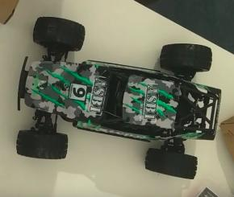
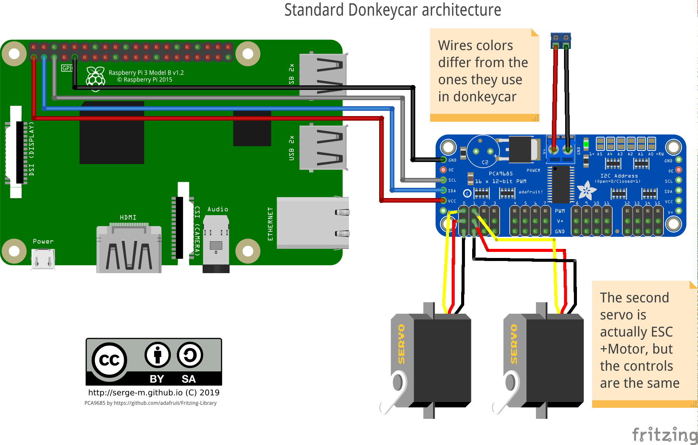
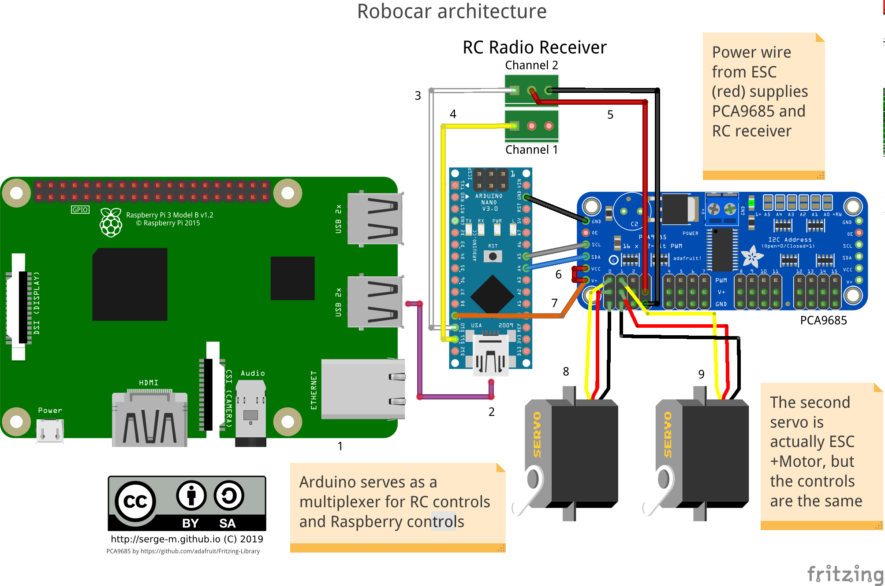

Title: Robocar project
Author: SergeM
Date: 2019-08-24 20:32:00
Slug: robocar
Tags: robocar, donkeycar, ros, linux, robotics, raspberry, pi, robot, 

For the robocar contest in Berlin I started a project of building an autonomous toy car (scale 1:10). The goal of the contest was to show the fastest lap driving autonomously. The track had 8-shape with lane boundaries marked with white tape.

Unfortunately the competition got cancelled. But that gave me an opportunity to switch from my 1st gen car to 2nd gen version.

Here is my first version:

<iframe width="560" height="315" src="https://www.youtube.com/embed/DsQgaF0_wzY" frameborder="0" allow="accelerometer; autoplay; encrypted-media; gyroscope; picture-in-picture" allowfullscreen></iframe>

The second version is built upon a stock RC car Absima Abs1

<iframe width="560" height="315" src="https://www.youtube.com/embed/xK2RTwvaCCo" frameborder="0" allow="accelerometer; autoplay; encrypted-media; gyroscope; picture-in-picture" allowfullscreen></iframe>

The default choice of the software for the robot was a project called [donkeycar](https://github.com/autorope/donkeycar). Donkeycar implements a driving stack in python. The AI is based on end-to-end machine learning model.

My first car was built with that stack and I was not quite happy about it. The code quality and version compatibility was far from ideal. Knowing that stack is unlikely to be useful outside of the contest.

Therefore I decided to build [the second version on top of ROS](https://github.com/serge-m/sergem_robocar) to learn that framework on the way. I found [project omicron](https://github.com/project-omicron) that became a basis for my car.

Project omicron had a goal to reimplement donkeycar functionality in ROS. 
I had patched it significantly to make it work for my hardware.

## Hardware
Donkeycar standard architecture looks like this:

I decided to introduce an intermediate layer of arduino that will (hopefully) protect my raspberry from undesired influence of high-current electornics of the car.

## Software 

Robocar runs on [Robot Operating System](https://www.ros.org/) (ROS). 
I use Ubuntu image with [preinstalled ROS from ubiquity](https://downloads.ubiquityrobotics.com/pi.html).
To run the the code is cloned on the image and I run some launch scripts manually via ssh terminal.
In the future I'll probably add some more user-friendly interface for that.

The system consists of the following nodes.

* `raspicam_node` - captures the images from Raspberry Pi camera and publishes to a ROS topic

* ai_driver - takes the image and produces steering and throttle values. The values are normalized. The range is (-1, 1).

* steering_translator - an auxiliary node that converts normalized steering to PWM signal for the servos.

* arduino bridge - listens to the converted steering topic and publishes the data to the arduino via serial port (USB). In addition it serves as a bridge for the PWM signals captured by arduino from RC-receiver.

* Arduino sketch takes care of several things:

    * measuring PWM signal from RC-receiver, 

    * publishing this received PWM to ROS
  
    * listening for PWM commands produced by ai_driver and translated by steering_translator
  
    * listening for a special topic that controls which PWM to use (one from radio or one from ai_driver)
  
    * shuts down throttle if there is no RC signal (safety measure)

Main repository: [https://github.com/serge-m/sergem_robocar](https://github.com/serge-m/sergem_robocar)

[Wiki](https://github.com/serge-m/sergem_robocar/wiki/)

[Some collected data to train your AI driver](https://github.com/serge-m/sergem_robocar/wiki/Training-AI-driver)
