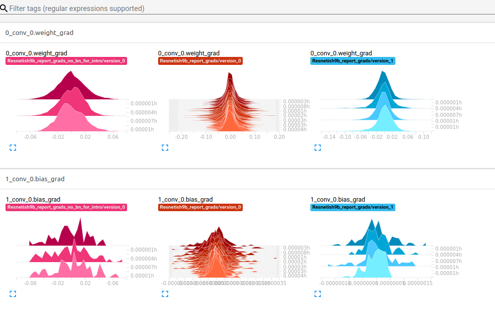

Title: Torch-Lightning library (draft)
Author: SergeM
Date: 2000-04-29 19:00:00
Slug: torch-lightning-library
Tags: python, deep learning, pytorch, torch, torch-lightning, tensorboard

# How to visualize gradients with torch-lightning and tensorboard

in your model class define a optimizer_step. 

    class Model(pl.LightningModule):
    
        # ...
        
        def optimizer_step(
                self,
                epoch: int,
                batch_idx: int,
                optimizer,
                optimizer_idx: int,
                second_order_closure = None,
        ) -> None:
            if self.trainer.use_tpu and XLA_AVAILABLE:
                xm.optimizer_step(optimizer)
            elif isinstance(optimizer, torch.optim.LBFGS):
                optimizer.step(second_order_closure)
            else:
                optimizer.step()
            
            #### Gradient reporting start ###
            if batch_idx % 500 == 0:
                for tag, param in self.model.named_parameters():
                    self.logger.experiment.add_histogram('{}_grad'.format(tag), param.grad.cpu().detach())
            #### Gradient reporting end   ###              
            
            # clear gradients
            optimizer.zero_grad()        
      
I have copied the code from the torch-lightning code. We have to add the gradient logging right before `optimizer.zero_grad`
call. 

Then in the trainer definition we have to specify tensorboard logger:

    logger = TensorBoardLogger("lightning_logs", name=name)

    # ...

    trainer = pl.Trainer(
        max_epochs=hparams.epochs,
        gpus=hparams.gpus,
        logger=logger,        
    )

This is how the visualization look like:
 

In the code of torch-lightning there is also a hook `on_before_zero_grad` for that: 
[github search](https://github.com/search?q=on_before_zero_grad&type=Code) But I wasn't able to understand how to use it.

