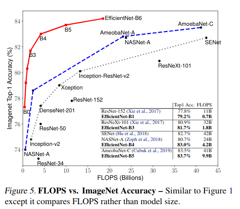
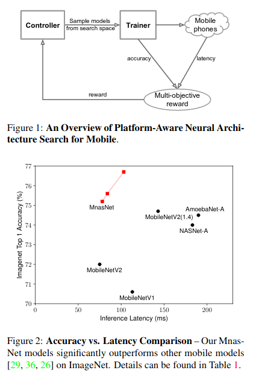
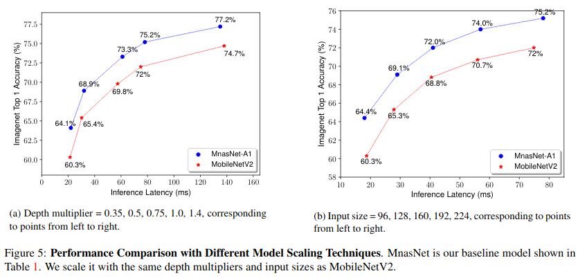

Title: Which pretrained backbone to choose 
Author: SergeM
Date: 2020-07-01 19:00:00
Slug: which-backbone-to-choose
Tags: machine learning, computer vision, DNN, CNN, deep learning, backbone, pytorch

In 2020 which architecture should I use for my image classification/tracking/segmentation/... task?

I was asked on an interview that and I didn't have a prepared answer.

I made a small research and want to write down some thoughts.

Most of the architectures build upon ideas from ResNet paper [Deep Residual Learning for Image Recognition, 2015](https://arxiv.org/abs/1512.03385)

Here is some explanation of resnet family:[An Overview of ResNet and its Variants]([https://towardsdatascience.com/an-overview-of-resnet-and-its-variants-5281e2f56035) by Vincent Fung, 2017. It is a bit dated already.

## EfficientNet

A recent paper 
[EfficientNet: Rethinking Model Scaling for Convolutional Neural Networks
by Mingxing Tan, Quoc V. Le, 2019](https://arxiv.org/abs/1905.11946)
explores the scaling of model hyperpameters to achieve computational effectiveness and performance in standard image classification tasks. 

The architecture is pretty simple. They focus on the scaling parameters of the network rather than finding good building blocks.

Pretrained weights can be found for Pytorch and Tensortflow:

* Repo for pytorch: [pytorch-image-models](https://github.com/rwightman/pytorch-image-models)

* another repo for pytorch: [imgclsmob](https://github.com/osmr/imgclsmob/tree/master/pytorch)

The performance with transfer learning seems pretty good. I have seen some doubts about using it on mobile devices. The gists is that EfficientNet is optimized with respect to the number of parameters, not actual Addition/Multiplications or FLOPS on the device. 
Here is a notebook with some experiments and critique of the efficient net: [on google colab](https://colab.research.google.com/github/rwightman/pytorch-image-models/blob/master/notebooks/EffResNetComparison.ipynb#scrollTo=iapzkrt2gBwR
), [on github](https://github.com/rwightman/pytorch-image-models/blob/master/notebooks/EffResNetComparison.ipynb)

Great discussion thread on fast.ai: https://forums.fast.ai/t/efficientnet/46978/79

## MNasNet

MnasNet paper [MnasNet: Platform-Aware Neural Architecture Search for Mobile](https://arxiv.org/pdf/1807.11626.pdf), Tan et. al 2019

Good - Pareto analysis, provide a range of networks for different speed/quality tradeoff. AutoML. They use MobilenetV2 as a base.

Those guise optimized for real mobile hardware.(see picture)
They claim to be 1.8 times faster  than Mobilenet V2 with the same performance.

>> our  slightly  larger  MnasNet-A3  modelachieves better accuracy than ResNet-50 [9], but with4.8×fewerparameters and10×fewermultiply-add cost

They also beat YOLOv2 for object detection on COCO in terms of quality. 

## MobileNet V2

Paper:  [MobileNetV2: Inverted Residuals and Linear Bottlenecks, Sander rt al, CVPR 2018](https://openaccess.thecvf.com/content_cvpr_2018/papers/Sandler_MobileNetV2_Inverted_Residuals_CVPR_2018_paper.pdf)

[Arxive version](https://arxiv.org/pdf/1801.04381.pdf)

Focus on the mobile platforms.

They implemented several important improvements to reduce the complexity:

*  Depthwise Separable Convolutions - instead of using C_out filters  of size W x H x C_in  we apply C_in filters of size W x H x 1 
  and then C_out filters of size 1 x 1 x C_in. Some kid of factorization.

    > The basic idea is to replace a full convolutional operator with a factorized version that splits convolution into two separate layers. The first layer is called a depthwise convolution, it performs lightweight filtering by applying a single convolutional filter per input channel.  The second layer is a1×1convolution, called a pointwise convolution, which is responsible for building new features through computing linear combinations of the in-put channels.

* Linear Bottlenecks - for dimensionality reduction

* Inverted residuals. 
  Well, nothing is really inverted. Just skip connections are binding low-resoltion bottleneck 
  layers instead of upscaled layers of hi resolution.

## RegNet 

Designing Network Design Spaces [paper](https://arxiv.org/abs/2003.13678) by Facebook AI Research (FAIR). 

Medium paper: [RegNet or How to methodologically design effective networks.](https://medium.com/analytics-vidhya/regnet-or-how-to-methodologically-design-effective-networks-c3560c1cf436)

A class of models that is designed for fast training and inference. 
The implementation and the trained weights can be found at pycls repo: [https://github.com/facebookresearch/pycls](https://github.com/facebookresearch/pycls)

The authors take a rather broad space of possible architectures an sample architectures from that space. 
They train and evaluate the sampled architectures to find what works best.

They claim the network 5 times faster than EfficientNet for some configurations. 
For the smaller networks the difference is much lower (~2 times). 
That fact is in sync with the experiments from `EffResNetComparison.ipynb` (see above).

Interesting example from [RegNet or How to methodologically design effective networks](https://medium.com/analytics-vidhya/regnet-or-how-to-methodologically-design-effective-networks-c3560c1cf436):

> MNASNets including MobileNets and EfficientNets extensively use Depthwise convolutions to achieve SoTA performances. These convolutions could be understood as group convolutions with group width of 1. The fact that AnyNetXb populations showed that g >1 is best, does not conflict with this fact. That such networks can and do perform excellently is not under question. The paper is empirically showing, with statistical backing to back the claim, that as a design space, g = 1 might be best avoided even though the MNAS search has found particular instances in which there are good performing models to build upon.

One more vitation from  [Facebook AI RegNet Models Outperform EfficientNet Models, Run 5x Faster on GPUs](https://medium.com/syncedreview/facebook-ai-regnet-models-outperform-efficientnet-models-run-5x-faster-on-gpus-7bdc3ea577ae)

> While it is common to see modern mobile networks employ inverted bottlenecks, researchers noticed that using inverted bottlenecks degrades performance. The best models do not use either a bottleneck or an inverted bottleneck.

## ResNeSt

ResNeSt: Split-Attention Networks [paper](https://arxiv.org/abs/2004.08955)

[resnest code](https://github.com/zhanghang1989/ResNeSt)

A pretty recent paper. The authors propose to split the channels into groups, process them with a separate sets of convolutions, and then concat them. 

They achieve a comparable (and better) performance with EfficientNet, while having less parameters and having better frame rate.

## Conclusion

I would start with ResNest given it's great performance. 

If I want to have a smaller network with less parameters I would go for Efficient net. That would probably make sense if I run without a GPU. The architecture of EfficientNet is proven to work well in several domains.

Regnet is not trained for the same amount of time and reports lower accuracy. The comparison provided in the paper uses re-trained Efficient Net Weights. It's unclear whether it will be comparable with on the full-blown training.

The backup plan is MNas and Mobilenet. If I need to run on a smaller device I would be more careful and considered MNasNet or Mobilenet V2/V3. 

